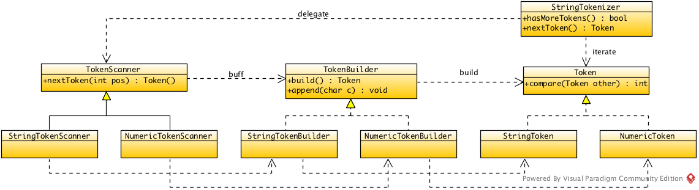

# Framework

## Separation of Concerns

There are different rules between string token and numeric token.

- Comparing Rule: string token is based on lexicographic order, but numeric token is based on the value and length.
- Building Rule: string token is composed of characters, but numeric token is composed of digits.
- Scanning Rule: string token contains escaped digits, but numeric token contains escaped characters.

## Algorithm

There is an iterating algorithm that read substrings while performing substring comparison without requiring all temporary substrings to be stored.

```cpp
/**
 * @return the value 0 if s1 == s2; -1 if s1 < s2; and 1 if s1 > s2.
 * @throw std::invalid_argument if contains invalid characters.
 */
int compare(const std::string& s1, const std::string& s2) {
  StringTokenizer st1(s1);
  StringTokenizer st2(s2);
  
  while (st1.hasMoreTokens() && st2.hasMoreTokens()) {
    if (auto result == st1.nextToken().compareTo(st2.nextToken())) {
      return result;
    }
  }
    
  if (st1.hasMoreTokens()) return 1;
  if (st2.hasMoreTokens()) return -1;
  return 0;
}
```

## Design



